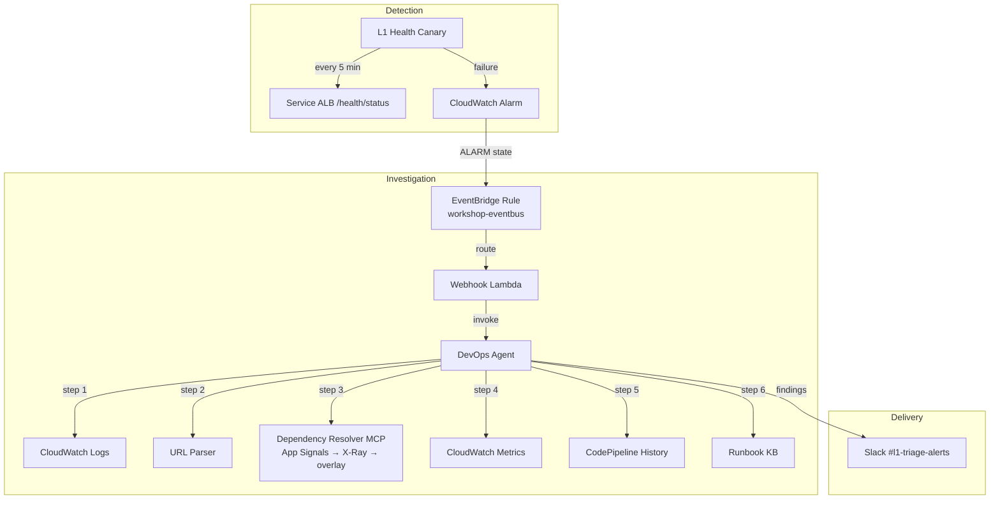
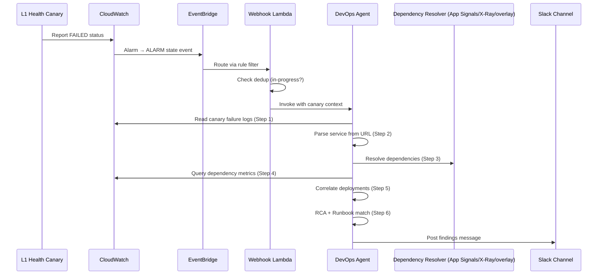

# Design Document: L1 Automated Triage

## Overview

L1 Automated Triage is a reusable, application-agnostic automated microservice health monitoring and root cause analysis system. It detects API health failures via CloudWatch Synthetics canaries, routes alarm events through a custom EventBridge bus to a webhook Lambda, orchestrates a 6-step investigation via the DevOps Agent, and delivers findings to Slack. The one-observability-demo pet adoption application is the initial validation target, not a limit on scope — the same system can be pointed at any application that exposes monitorable endpoints and infrastructure dependencies.

### Reuse vs. Build

The system is deliberately designed to reuse the detection primitives that the one-observability-demo stack already provides, and to build net-new only the investigation and delivery capabilities that are missing. Verification of the existing one-observability-demo CDK code confirms the following split:

**Reused from the existing stack (no duplication):**

- The `WorkshopCanary` base construct — provides the 5-minute schedule, Secrets Manager/SSM access, S3 artifact storage, and X-Ray tracing already wired for canaries.
- The custom `workshop-eventbus` EventBridge bus — the existing event-driven backbone used by the petfood architecture; L1 triage events flow alongside existing events on this bus rather than the default bus.
- The `WorkshopLambdaFunction` base pattern — provides DLQ, structured logging, X-Ray tracing, and Application Signals instrumentation for Lambda functions.
- The existing DynamoDB construct pattern — the established convention for defining tables in the storage layer.

**Built net-new by this feature:**

- The **canary availability CloudWatch Alarm** on the canary `SuccessPercent` metric. The existing stack defines DynamoDB throttle alarms but has **no canary-availability alarm wired** — this alarm is net-new and is the trigger for the entire triage flow.
- The **EventBridge rule** that filters CloudWatch Alarm state-change events (ALARM state, `l1t-health-` name prefix) and routes them to the Webhook Lambda.
- The **Webhook Lambda** (`L1WebhookLambda`) that receives alarm events, deduplicates, and invokes the DevOps Agent.
- The **Dependency Resolver MCP server** that resolves a microservice to its infrastructure dependencies and dependents, telemetry-first (CloudWatch Application Signals → AWS X-Ray → optional declared overlay).
- The **optional `l1t-service-dependencies` DynamoDB table** used only as the declared overlay (gap-fill / un-instrumented apps), not as the primary source.
- The **6-step DevOps Agent triage skill** ("L1 Microservice Triage").
- The **Runbook Knowledge Base** of failure patterns and remediations.
- The **Slack delivery integration**.

> Note: the correct base class name is `WorkshopLambdaFunction`. Earlier drafts of this document contained a typo (`WokshopLambdaFunction`); it is corrected throughout.

### Key Adaptations for the Validation Target (one-observability-demo)

| Requirements Concept | Adapted Implementation |
|---------------------|----------------------|
| `/api-wg/{service-group}/{service-name}` URL pattern | ALB URLs: `http://{alb-dns}/health/status` per service |
| ElastiCache/MSK dependencies | RDS (Aurora PostgreSQL) + DynamoDB are the available dependencies |
| ConfigMap (Kubernetes) as dependency source | CloudWatch Application Signals (`ListServiceDependencies`/`ListServiceDependents`) primary → X-Ray service graph fallback → optional `l1t-service-dependencies` DynamoDB overlay |
| GitHub Deployments API | CodePipeline/CodeBuild execution timestamps |
| Service groups | Flat service names: `payforadoption-go`, `petlistadoptions-py`, etc. |

> **Application-agnostic note:** The one-observability-demo app has no Kubernetes ConfigMap describing service dependencies (only `petsite` runs on EKS; the rest run on ECS Fargate, which has no ConfigMaps). Rather than hardcode this app's topology, the design resolves dependencies from observability telemetry, which every instrumented service already emits. This keeps the system reusable for any containerized application, with the DynamoDB overlay reserved for gaps or un-instrumented apps.

## Architecture



### Data Flow Sequence



## Components and Interfaces

### 1. L1 Health Canary (extends `WorkshopCanary`)

A new canary construct that performs HTTP GET health checks against each monitored microservice's ALB endpoint.

```typescript
interface L1HealthCanaryProperties extends WorkshopCanaryProperties {
    /** DynamoDB table or SSM parameter for target URLs */
    targetUrlsSource: string;
    /** Secrets Manager ARN for auth credentials */
    credentialsSecretArn: string;
    /** Timeout for each health check request in ms */
    requestTimeoutMs?: number; // default: 30000
}
```

**Design Decision**: Extend `WorkshopCanary` rather than creating a separate construct. The base class already handles IAM role creation, S3 artifact storage, schedule configuration, and X-Ray tracing. We add Secrets Manager access and structured failure logging.

**Canary Script Pattern** (Node.js, syn-nodejs-puppeteer-11.0):
- Retrieve credentials from Secrets Manager
- For each configured URL, execute HTTP GET with 30s timeout
- **Follow redirects (up to 5 hops) and judge the final response.** A bare 3xx is neither pass nor fail on its own — the canary follows the `Location` chain and classifies the *final* status: final 2xx = success, final non-2xx = failure, no response = timeout, redirect loop / exceeding 5 hops / invalid Location = failure. This is AWS-aligned: CloudFront relays 3xx to the client rather than following it ([How CloudFront processes HTTP 3xx status codes](https://docs.aws.amazon.com/AmazonCloudFront/latest/DeveloperGuide/http-3xx-status-codes.html)), so the client (canary) must follow the redirect to determine health. The workshop PetSite URL (behind CloudFront) returns a 302 at the root, which is healthy once followed.
- Log structured JSON: `{ url, finalUrl, redirectChain, redirectCount, statusCode, responseBody, latencyMs, timestamp }`
- Report success/failure to CloudWatch Synthetics metrics

> **Runtime note:** the implementation uses `syn-nodejs-puppeteer-11.0` to match the workshop's existing canaries (earlier drafts referenced 9.1).

**Integration with existing infrastructure**:
- Reuses the `canaryArtifactBucket` already created in `MicroservicesStack`
- Registered alongside existing `TrafficGeneratorCanary` and `HouseKeepingCanary`
- Uses `rate(5 minutes)` schedule (same as existing canaries)

### 2. CloudWatch Alarm + EventBridge Rule

**Alarm**: One alarm per canary, configured to transition to ALARM on any single failure (evaluation period = 1, threshold = 1 failed execution). This availability alarm is built on the canary `SuccessPercent` metric and is net-new — the existing stack has DynamoDB throttle alarms but no canary-availability alarm.

**EventBridge Rule**: Filters on the existing `workshop-eventbus` for CloudWatch Alarm state change events matching pattern:
```json
{
    "source": ["aws.cloudwatch"],
    "detail-type": ["CloudWatch Alarm State Change"],
    "detail": {
        "alarmName": [{ "prefix": "l1t-health-" }],
        "state": { "value": ["ALARM"] }
    }
}
```

**Design Decision**: Use the existing `workshop-eventbus` rather than the default bus. This keeps triage events isolated alongside the existing petfood event-driven architecture and allows event replay for debugging.

### 3. Webhook Lambda

A Node.js Lambda function that receives alarm events and invokes the DevOps Agent.

```typescript
interface WebhookLambdaProperties extends WorkshopLambdaFunctionProperties {
    /** DevOps Agent endpoint URL or ARN */
    devopsAgentEndpoint: string;
    /** DynamoDB table for deduplication state */
    deduplicationTable: ITable;
    /** Slack webhook URL (fallback notifications) */
    slackWebhookUrl: string;
}
```

**Deduplication Strategy**: Uses a DynamoDB table with TTL to track in-progress investigations. Key = canary name, TTL = 15 minutes. Before invoking the agent, the Lambda performs a conditional put; if the item already exists, the invocation is skipped and the event is logged.

**Retry Logic**: Exponential backoff (1s, 2s, 4s) with 3 max attempts. On exhaustion, posts a failure notification to Slack with the canary name.

**Integration**: Extends `WorkshopLambdaFunction` base class to inherit DLQ, structured logging, X-Ray tracing, and Application Signals instrumentation.

### 4. Dependency Resolver MCP Server (telemetry-first)

A custom MCP (Model Context Protocol) server that resolves a microservice to its infrastructure dependencies (downstream) and dependents (upstream) so the triage can reason about both what a failing service relies on and its blast radius. Resolution is telemetry-first and application-agnostic: any instrumented app yields its graph automatically, with a declared overlay reserved for gaps.

**Resolution order (per Requirement 5.2):**

1. **Primary — CloudWatch Application Signals.** Call `ListServiceDependencies` (downstream) and `ListServiceDependents` (upstream). Application Signals auto-discovers services and their dependencies from OpenTelemetry data, and its dependents explicitly include CloudWatch Synthetics canaries — the same canaries that trigger this triage.
2. **Fallback — AWS X-Ray service graph.** If Application Signals returns no results or is unavailable, call `GetServiceGraph`, locate the node for the target service, and read its downstream `Edges`. Invert the graph (find nodes whose edges point at the target's `ReferenceId`) to derive upstream dependents.
3. **Last resort — Declared Overlay.** If both telemetry sources return nothing, read the optional `l1t-service-dependencies` DynamoDB overlay.

**MCP Tool Definition**:
```json
{
    "name": "resolve_service_dependencies",
    "description": "Resolves downstream dependencies and upstream dependents for a microservice, telemetry-first",
    "parameters": {
        "serviceName":   { "type": "string", "description": "Microservice name" },
        "environment":   { "type": "string", "description": "Deployment environment (e.g. 'workshop')" },
        "failureTimestamp": { "type": "string", "description": "ISO 8601 canary failure time; used to derive the lookup window" }
    }
}
```

> **Contract change:** The earlier design exposed `lookup_service_dependencies(serviceName)`. The resolver now also needs `environment` and `failureTimestamp`, because Application Signals keys a service by `KeyAttributes { Type, Name, Environment }` and requires a time window.

#### Application Signals API (verified — service `application-signals`, API version `2024-04-15`)

**`ListServiceDependencies`** (downstream) and **`ListServiceDependents`** (upstream) share the same shape:

- Request: `POST /service-dependencies` (or `/service-dependents`) with query params `StartTime`, `EndTime` (epoch seconds, **required**, **rounded to the nearest hour**), optional `MaxResults` (1–100, default 50) and `NextToken`; body `{ "KeyAttributes": { ... } }`.
- `KeyAttributes` is a string→string map, max 4 entries, and must include at least `Type`, `Name`, and `Environment`. `Type` ∈ `Service` | `RemoteService` | `Resource` | `AWS::Service` | `AWS::Resource`. For a resource dependency, `ResourceType` + `Identifier` identify it.
- Response `ServiceDependencies[]` (or `ServiceDependents[]`), each entry containing:
  - `DependencyKeyAttributes` (or `DependentKeyAttributes`) — the identity of the dependency/dependent, i.e. how we learn it is an RDS cluster, DynamoDB table, peer service, or canary.
  - `DependencyOperationName` / `OperationName`.
  - `MetricReferences[]` — `{ Namespace, MetricName, MetricType, Dimensions[], AccountId }`. **These are the metrics Application Signals already associates with the dependency and feed Step 4 directly, avoiding hardcoded per-type metric mappings.**
- Errors: `ThrottlingException` (429) → retry with backoff; `ValidationException` (400) → bad `KeyAttributes`, do not retry.

**Time window:** derive `[StartTime, EndTime]` from `failureTimestamp` (roughly the hour containing and preceding the failure). Because Application Signals rounds to the nearest hour, the dependency-resolution window is effectively hour-granular even though the metrics step (Step 4) uses the tight 15-minute window.

#### X-Ray API (verified — service `xray`, API version `2016-04-12`)

**`GetServiceGraph`** (fallback):

- Request: `POST /ServiceGraph`, body `{ StartTime, EndTime (epoch seconds, required), GroupARN?, GroupName?, NextToken? }`. No `KeyAttributes` — it returns the whole graph (optionally scoped by group), so the resolver locates the target node itself.
- Response `Services[]`, each with `Name`/`Names`, `Type`, `Root` (bool), `ReferenceId`, and `Edges[]`. Each edge has a `ReferenceId` pointing at the downstream node plus `SummaryStatistics` (`ErrorStatistics`, `FaultStatistics`, `OkCount`, `TotalCount`, `TotalResponseTime`). Downstream nodes can be services, AWS resources, HTTP APIs, or SQL databases.
- Direction: edges are downstream-only; invert the graph for upstream dependents.
- Errors: `ThrottledException` (429) → retry with backoff; `InvalidRequestException` (400) → do not retry.

#### Declared Overlay — DynamoDB Table Schema (`l1t-service-dependencies`, optional)

| Attribute | Type | Description |
|-----------|------|-------------|
| `serviceName` (PK) | String | Microservice identifier (e.g., `payforadoption-go`) |
| `dependencies` | List<Map> | Array of `{ resourceType, resourceId, metricsNamespace, metricsConfig }` |
| `lastRefreshedAt` | String | ISO 8601 timestamp of last overlay reconcile |

**Design Decision — DynamoDB for the overlay** (over S3): sub-2-second single-item reads by service name (Requirement 6.4), the existing DynamoDB construct pattern is well-established, and it is consistent with the workshop's DynamoDB-first approach. The overlay is **optional** — its absence is not an error (Requirement 6.1).

**Weekly reconcile:** A scheduled Lambda (EventBridge `cron(0 2 ? * SUN *)`) reconciles operator-authored dependency records from a seed source (a committed file, an SSM parameter, or a deliberately populated Kubernetes ConfigMap) into the overlay table and updates `lastRefreshedAt`. Staleness detection (Requirement 6.5) — if `lastRefreshedAt` > 14 days and the overlay contributes to a result, the response includes a warning field.

### 5. DevOps Agent Triage Skill

The "L1 Microservice Triage" skill defines a 6-step investigation runbook:

| Step | Action | Tools Used |
|------|--------|-----------|
| 1. Extract Failure | Read canary logs | CloudWatch Logs Insights |
| 2. Identify Service | Parse URL path | Built-in string parsing |
| 3. Resolve Dependencies | Resolve infra deps + dependents (telemetry-first) | Dependency Resolver MCP |
| 4. Query Metrics | Check dependency health | CloudWatch GetMetricData |
| 5. Correlate Deployments | Find recent deploys | CodePipeline ListPipelineExecutions |
| 6. Root Cause + Fix | Determine RCA, match runbook | Runbook KB |

**Skill YAML Definition**:
```yaml
name: L1 Microservice Triage
description: Automated 6-step root cause analysis for microservice API failures
steps:
  - name: extract_failure_details
    description: Read most recent failure from canary CloudWatch logs
    tools: [cloudwatch_logs_query]
  - name: identify_microservice
    description: Parse service name from failed URL path
    tools: []
  - name: resolve_dependencies
    description: Resolve infrastructure dependencies and dependents (telemetry-first)
    tools: [resolve_service_dependencies]
  - name: query_dependency_metrics
    description: Query CloudWatch metrics for each dependency
    tools: [cloudwatch_get_metric_data]
  - name: correlate_deployments
    description: Check for recent CodePipeline executions
    tools: [codepipeline_list_executions]
  - name: root_cause_analysis
    description: Correlate findings and match against runbook
    tools: [runbook_kb_search]
```

**URL Parsing Adaptation**: Since the validation target uses ALB URLs (`http://{alb-dns}/health/status`) rather than `/api-wg/` paths, the service identification step maps ALB DNS hostnames to service names using an SSM parameter or DynamoDB lookup. Fallback: if the URL contains the service name as a path segment (e.g., `/payforadoption-go/health/status`), extract directly.

**Deployment Correlation Adaptation**: Instead of GitHub Deployments API, query CodePipeline for executions of the pipeline associated with the affected service within the last 60 minutes.

### 6. Slack Integration

Posts structured messages to `#l1-triage-alerts` using an incoming webhook URL stored in Secrets Manager.

**Message Format** (Block Kit):
```json
{
    "blocks": [
        { "type": "header", "text": "🚨 L1 Triage Complete" },
        { "type": "section", "fields": [
            { "type": "mrkdwn", "text": "*Failed URL:* {url}" },
            { "type": "mrkdwn", "text": "*Service:* {serviceName}" },
            { "type": "mrkdwn", "text": "*Dependency Issue:* {depIssue}" },
            { "type": "mrkdwn", "text": "*Root Cause:* {rca}" },
            { "type": "mrkdwn", "text": "*Recommended Fix:* {fix}" },
            { "type": "mrkdwn", "text": "*Confidence:* {level}" }
        ]}
    ]
}
```

Retry: 3 attempts with exponential backoff. On failure, log the undelivered payload to CloudWatch for later retrieval (Requirement 10.4).

## Data Models

### Resolver Output (normalized across sources)

The Dependency Resolver MCP normalizes Application Signals, X-Ray, and overlay results into a single shape returned to the triage skill:

```typescript
interface DependencyResolution {
    serviceName: string;
    source: 'ApplicationSignals' | 'XRay' | 'DeclaredOverlay';
    dependencies: Dependency[];   // downstream: DBs, caches, queues, peer services
    dependents: Dependent[];      // upstream callers, including the triggering canary
    stale: boolean;               // true only when served from an overlay older than 14 days
}

interface Dependency {
    resourceType: 'RDS' | 'DynamoDB' | 'ElastiCache' | 'MSK' | 'Service' | 'Unknown';
    resourceId: string;                 // e.g., Aurora cluster identifier or peer service name
    metricReferences: MetricReference[];// preferred; populated from the source when available
}

interface Dependent {
    type: 'Service' | 'Canary' | 'Client';
    identifier: string;                 // e.g., "l1t-health-payforadoption" for the canary
}

// Mirrors the Application Signals MetricReferences shape
interface MetricReference {
    namespace: string;     // e.g., "AWS/RDS"
    metricName: string;    // e.g., "CPUUtilization"
    metricType?: string;
    dimensions: { name: string; value: string }[];
    accountId?: string;
}
```

### Declared Overlay Record (DynamoDB, optional)

```typescript
interface ServiceDependencyOverlay {
    serviceName: string;          // PK: "payforadoption-go"
    dependencies: OverlayDependency[];
    lastRefreshedAt: string;      // ISO 8601: "2025-01-15T02:00:00Z"
}

interface OverlayDependency {
    resourceType: 'RDS' | 'DynamoDB' | 'ElastiCache' | 'MSK';
    resourceId: string;                 // e.g., Aurora cluster identifier
    metricsNamespace: string;           // e.g., "AWS/RDS"
    metricsConfig: MetricDefinition[];
}

interface MetricDefinition {
    metricName: string;    // e.g., "CPUUtilization"
    statistic: string;     // e.g., "Average"
    thresholdValue: number;
    thresholdOperator: 'gt' | 'lt' | 'eq';
}
```

### Deduplication Record (DynamoDB)

```typescript
interface InvestigationLock {
    canaryName: string;    // PK: "l1t-health-payforadoption"
    startedAt: string;     // ISO 8601
    agentInvocationId: string;
    ttl: number;           // Unix epoch + 900 (15 min)
}
```

### Triage Output (Agent Response)

```typescript
interface TriageResult {
    canaryName: string;
    failedUrl: string;
    serviceName: string | null;
    httpStatusCode: number | null;
    errorBody: string | null;
    dependencies: DependencyHealth[];
    deployments: DeploymentCorrelation[];
    rootCause: string | null;
    recommendedFix: string | null;
    confidenceLevel: 'High' | 'Medium' | 'Low';
    completedSteps: number;
    failedStep: string | null;
}

interface DependencyHealth {
    resourceType: string;
    resourceId: string;
    metrics: { name: string; value: number; anomalous: boolean }[];
}

interface DeploymentCorrelation {
    pipelineExecutionId: string;
    startTime: string;
    status: string;
}
```

### Runbook Knowledge Base Entry

```typescript
interface RunbookEntry {
    pattern: string;           // e.g., "RDS_CPU_HIGH"
    condition: string;         // e.g., "CPUUtilization > 90%"
    recommendation: string;    // e.g., "Add read replica or upsize instance"
    severity: 'Critical' | 'High' | 'Medium' | 'Low';
}
```

## Correctness Properties

*A property is a characteristic or behavior that should hold true across all valid executions of a system — essentially, a formal statement about what the system should do. Properties serve as the bridge between human-readable specifications and machine-verifiable correctness guarantees.*

### Property 1: Health check execution completeness

*For any* set of configured target URLs, the canary SHALL execute an HTTP request against every URL in the set within a single 5-minute execution cycle, reporting either a success or failure status for each.

**Validates: Requirements 1.1, 1.4, 1.5, 1.6**

### Property 2: Credential retrieval failure isolation

*For any* canary execution where Secrets Manager is unreachable or returns an error, the canary SHALL report a credential failure status and SHALL NOT attempt any health check HTTP requests.

**Validates: Requirements 1.3**

### Property 3: Structured log completeness

*For any* canary execution that performs an HTTP request, the resulting log entry SHALL contain the request URL, and SHALL contain the response status code if a response was received, or a timeout indicator if no response was received within 30 seconds.

**Validates: Requirements 1.7, 3.5**

### Property 4: Alarm-to-Lambda latency bound

*For any* canary failure event, the elapsed time from failure recording in CloudWatch to Webhook Lambda invocation SHALL be less than 90 seconds (60s alarm transition + 30s EventBridge routing).

**Validates: Requirements 2.1, 2.2**

### Property 5: Deduplication prevents concurrent investigations

*For any* pair of alarm events for the same canary arriving within 15 minutes, the system SHALL invoke the DevOps Agent exactly once and log the duplicate event without triggering a second investigation.

**Validates: Requirements 2.6**

### Property 6: Retry exhaustion triggers Slack notification

*For any* Webhook Lambda invocation where all 3 retry attempts to the DevOps Agent fail, the system SHALL post a failure notification to Slack within 60 seconds of the final retry failure, containing the canary name.

**Validates: Requirements 2.4, 2.5**

### Property 7: URL parsing extracts service identity

*For any* URL containing a known service name as a path segment or matching the ALB DNS-to-service mapping, the triage skill SHALL correctly extract and return the service name.

**Validates: Requirements 4.1, 4.2, 4.3**

### Property 8: Dependency resolution returns within SLA

*For any* service resolved via the Declared Overlay, the Dependency Resolver MCP SHALL return the overlay lookup portion within 2 seconds; and *for any* resolution, the MCP SHALL either return a result or fail within the 5-second budget the triage skill allows for step 3.

**Validates: Requirements 5.1, 6.4**

### Property 9: Staleness warning on old data

*For any* dependency resolution served from the Declared Overlay where `lastRefreshedAt` is older than 14 days from the current time, the response SHALL include a staleness warning indicator.

**Validates: Requirements 6.5**

### Property 10: Metric query covers correct time window

*For any* dependency metrics query, the time range SHALL span exactly the 15-minute window preceding the canary failure timestamp, with 60-second period and Average statistic.

**Validates: Requirements 7.1**

### Property 11: Confidence level assignment is deterministic

*For any* triage result, the confidence level SHALL be High when 3+ correlated metrics support the root cause, Medium when exactly 2 metrics support it, and Low when 1 or fewer metrics support it or no runbook match exists.

**Validates: Requirements 9.7**

### Property 12: Slack message contains all required fields

*For any* completed triage, the Slack message SHALL contain separately labeled sections for: failed URL, service name, dependency issue, root cause, recommended fix, and confidence level. Missing values SHALL display an "unavailable" indicator rather than being omitted.

**Validates: Requirements 10.1, 10.2**

### Property 13: Partial findings on triage failure

*For any* triage that fails at step N (where N > 1), the Slack message SHALL include all field values gathered in steps 1 through N-1 and SHALL indicate the name of the failed step.

**Validates: Requirements 10.3**

## Error Handling

| Error Scenario | Handler | Recovery |
|---------------|---------|----------|
| Secrets Manager unreachable | Canary script | Log credential error, skip health checks, report failure status |
| HTTP request timeout (30s) | Canary script | Report timeout failure with URL and latency |
| HTTP redirect (3xx) | Canary script | Follow up to 5 hops, judge final status; redirect loop / over-cap / invalid Location = failure |
| EventBridge delivery failure | EventBridge DLQ | Retry via built-in EventBridge retry policy (2 attempts) |
| Webhook Lambda throttled | SQS DLQ (from `WorkshopLambdaFunction` base) | Messages retained for 14 days for manual replay |
| DevOps Agent invocation timeout | Webhook Lambda retry | 3 retries with exponential backoff (1s, 2s, 4s) |
| DevOps Agent all retries failed | Webhook Lambda | Post failure notification to Slack |
| DynamoDB conditional put conflict (dedup) | Webhook Lambda | Log duplicate, skip invocation (not an error) |
| Dependency Resolver MCP timeout (5s) | Triage Skill step 3 | Continue with deployment correlation only |
| Application Signals throttled / X-Ray throttled | Dependency Resolver MCP | 3 retries with backoff, then fall through to next source (X-Ray, then overlay) |
| Application Signals + X-Ray both empty | Dependency Resolver MCP | Consult optional Declared Overlay; if also empty, report "no known dependencies" |
| CloudWatch Metrics API throttle | Triage Skill step 4 | 3 retries with backoff, then skip dependency with error |
| CodePipeline API failure | Triage Skill step 5 | Mark deployment correlation as "inconclusive" |
| Runbook KB no match | Triage Skill step 6 | Return raw RCA, assign Confidence_Level = Low |
| Slack webhook failure (3 retries) | Delivery | Log undelivered payload to CloudWatch for retrieval |

**Stack rollback**: CDK handles atomic deployment via CloudFormation. Failed deployments roll back all resources to their prior state (Requirement 11.5).

## Testing Strategy

### Unit Tests

- **Canary script logic**: Test URL iteration, credential retrieval error handling, response code classification, timeout detection, structured log formatting
- **Webhook Lambda**: Test event parsing, deduplication logic (DynamoDB conditional write), retry behavior, Slack fallback notification
- **URL parser**: Test service name extraction from various URL formats (ALB DNS, path-based, unknown patterns)
- **Dependency Resolver MCP**: Test resolution order (App Signals → X-Ray → overlay fallthrough), `KeyAttributes` construction, hour-rounded window derivation, throttle retry/backoff, upstream-graph inversion for X-Ray, overlay staleness calculation, empty result handling, and timeout behavior
- **Confidence level calculation**: Test all boundary conditions (0, 1, 2, 3+ correlated metrics)
- **Slack message builder**: Test field formatting with all combinations of available/missing values

### Integration Tests

- **End-to-end alarm flow**: Deploy canary with a known-failing URL, verify alarm triggers and event reaches Lambda
- **DynamoDB deduplication**: Send concurrent alarm events, verify only one agent invocation occurs
- **Dependency resolution (telemetry + overlay)**: Resolve a service with Application Signals available (verify downstream + upstream), with Application Signals empty (verify X-Ray fallback), and with both empty (verify overlay); run the overlay reconcile Lambda and verify DynamoDB contents
- **Slack delivery**: Invoke with mock triage result, verify message arrives in test channel

### Infrastructure Tests

- **CDK snapshot tests**: Verify synthesized CloudFormation template matches expected resource definitions
- **IAM policy validation**: Verify least-privilege scoping (no wildcard resource ARNs except where required)
- **Idempotent deployment**: Deploy stack twice with identical parameters, verify no errors or duplicates (Requirement 11.6)

### Property-Based Tests

Property-based testing applies to the pure logic components of this system:

- **URL parser** (Property 7): Generate random URL strings mixing known service names, paths, and query params
- **Confidence level calculator** (Property 11): Generate random metric count inputs, verify deterministic output
- **Staleness detector** (Property 9): Generate random timestamps, verify 14-day boundary calculation
- **Slack message builder** (Property 12, 13): Generate random TriageResult objects with null/present fields, verify all sections present
- **Log entry parser** (Property 3): Generate random log entries with missing fields, verify graceful extraction

**Testing library**: fast-check (TypeScript property-based testing)  
**Configuration**: Minimum 100 iterations per property test  
**Tag format**: `Feature: l1-automated-triage, Property {N}: {title}`

### Incremental Deployment & Testing

The system is decomposed into five independently deployable slices so it can be validated one capability at a time in an Isengard account. Each slice is deployed via `cdk deploy` against the target AWS account (supplied as a deploy-time parameter) and is testable at the end of the slice before moving on.

| Slice | Capability | New resources | Validation at end of slice |
|-------|-----------|---------------|----------------------------|
| **1** | Detection | `L1HealthCanary` + availability CloudWatch Alarm on `SuccessPercent` | `cdk deploy` → confirm canary executes on schedule, canary failures appear in CloudWatch Synthetics, and the alarm transitions to ALARM state |
| **2** | Routing | EventBridge rule (on `workshop-eventbus`) + `L1WebhookLambda` | `cdk deploy` → force the alarm to ALARM and confirm the Lambda fires (agent call stubbed as log-only at this stage) |
| **3** | Dependency resolution | Dependency Resolver MCP (App Signals → X-Ray → overlay) + optional `l1t-service-dependencies` overlay table + weekly reconcile | `cdk deploy` → resolve a known service and confirm downstream dependencies + upstream dependents come back from Application Signals (and that X-Ray/overlay fallbacks work) |
| **4** | Investigation | 6-step DevOps Agent triage skill + metrics/deployment correlation | `cdk deploy` → run the full 6-step skill against a real failure and confirm metrics and deployment correlation produce a root cause |
| **5** | Delivery | Slack delivery integration | `cdk deploy` → run an end-to-end triage and confirm the findings message arrives in `#l1-triage-alerts` |

Because each slice is additive and independently deployable, a builder can adopt the system incrementally, verifying detection before wiring routing, routing before investigation, and investigation before delivery. This also localizes troubleshooting: a failure observed after deploying slice N is scoped to the resources introduced in that slice.

### IaC Additions to Existing CDK Stack

New resources are added to the `applications` stage (consistent with existing canary and Lambda placement) and deploy to the target AWS account (supplied as a deploy-time parameter, so the system is deployable to any account/Isengard environment):

1. **`L1HealthCanary`** — new construct extending `WorkshopCanary`, registered in the canaries map
2. **CloudWatch Alarm** — attached to canary success percentage (`SuccessPercent`) metric (net-new; no canary-availability alarm exists in the base stack)
3. **EventBridge Rule** — on existing `workshop-eventbus`, targeting Webhook Lambda
4. **`L1WebhookLambda`** — new construct extending `WorkshopLambdaFunction`
5. **`l1t-service-dependencies` DynamoDB table** — optional declared overlay, added to `StorageStack` alongside existing tables
6. **`l1t-investigation-locks` DynamoDB table** — TTL-enabled, for deduplication
7. **Overlay Reconcile Lambda** — scheduled weekly via EventBridge, reconciles the seed source into the overlay table
8. **Secrets Manager secret** — for Slack webhook URL (created as a parameter, populated manually)

**IAM additions for dependency resolution:** the Dependency Resolver MCP / agent role requires `application-signals:ListServiceDependencies`, `application-signals:ListServiceDependents`, and `xray:GetServiceGraph` (read-only), plus `dynamodb:GetItem` on the overlay table. These are scoped to the specific resources per Requirement 11.4 (no wildcard ARNs except where the service requires them).

All resources deploy within the existing CDK pipeline using `cdk deploy` with no manual console steps required.
